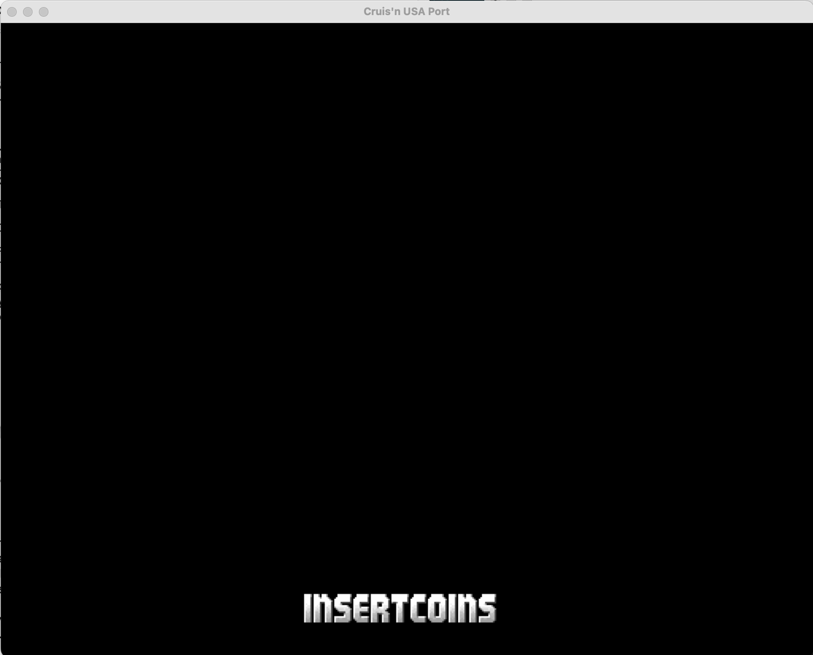
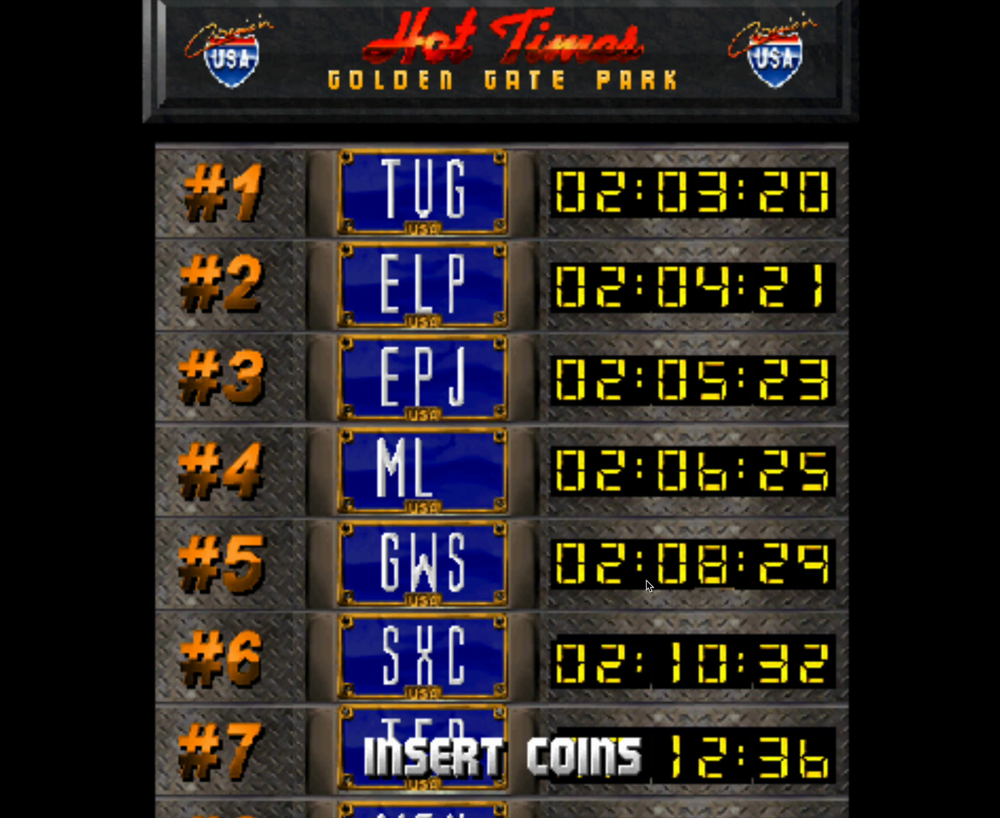
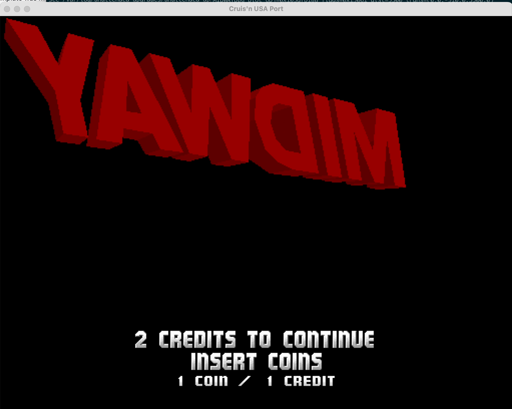
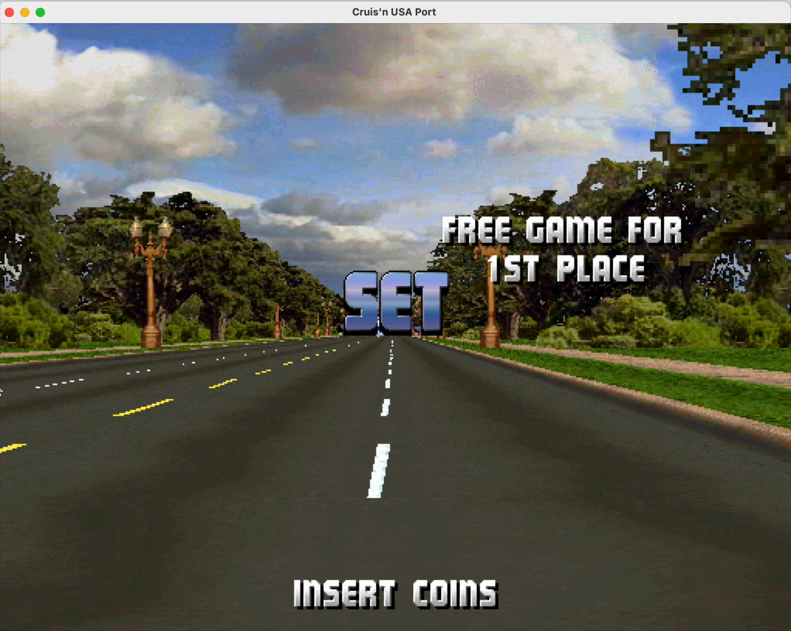
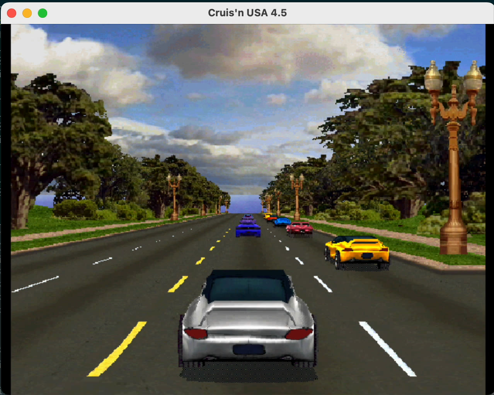
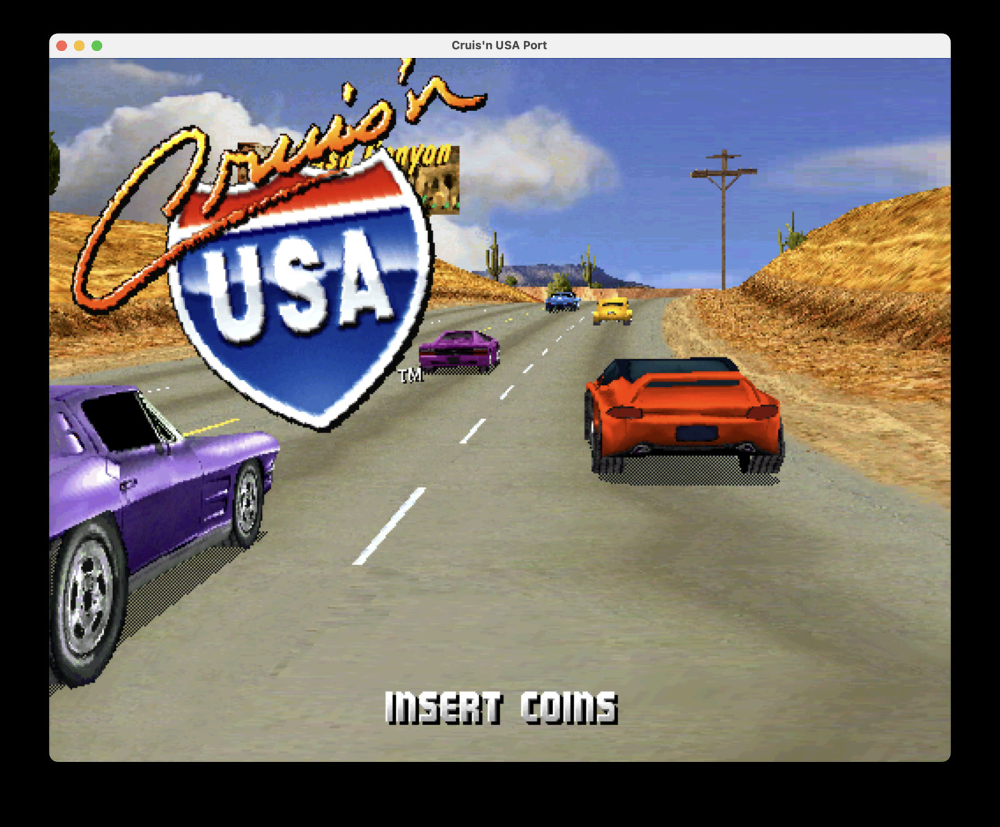

# Cruis'n USA: rebuilding the arcade game from its original assembly

_TL;DR — I am building [a native port of the original Cruis'n USA arcade game](https://github.com/jeff-1amstudios/cruisin-usa), translating its TMS320C30 assembly into portable C and SDL. Having the original source should have made this easy. Instead, the source was for version 4.4, the arcade ROM I wanted to reproduce was version 4.5, and the most important early step was deleting my first 8,759 lines of generated C._

## This time, there was source code

My [Dethrace project](/articles/dethrace/) began with the opposite problem. For Carmageddon, we had a retail executable and an old debugging-symbol file, but no source. We had to reconstruct the C one function at a time and use the original x86 executable to check our work.

Cruis'n USA appeared to offer the luxury version of game archaeology: the original arcade assembly source had been published by [Historical Source](https://github.com/historicalsource/cruisin-usa). It was not pseudocode or a disassembly. It was the real Midway codebase, with filenames such as `ATTRACTA.ASM`, `DRONES.ASM` and `ROADKILL.ASM`, the original labels, data definitions and developer comments.

The game was written primarily in assembly for the Texas Instruments TMS320C30, a digital signal processor rather than the x86 CPU found in a normal 1990s PC. The C30 is word-addressed, has its own floating-point format, branch delay slots and several habits that do not map politely onto modern C. Still, this seemed like a much better starting point than a mystery executable.

I made the first port commit on May 16, 2026. A scaffold generator turned the assembly modules into 107 C and header files: 8,759 lines containing function shapes, rough translations and plenty of stubs. It looked impressively like a port.

It was also the wrong foundation.

## 4.4 source, 4.5 machine

The published source builds version 4.4 of the game. The common retail ROM, and the version I wanted the port to reproduce, is 4.5.

That small decimal difference is a large reverse-engineering problem. Functions had moved. Instructions had changed. Constants and asset addresses no longer lined up. Some final data was absent from the source archive altogether. A perfectly faithful translation of 4.4 could still disagree with the game running in an arcade cabinet.

So on May 29, the repository's next substantial commit removed the whole first port and replaced it with analysis tools. The port had briefly gone backwards by nearly nine thousand lines, which was exactly the progress it needed.

I built a source-to-ROM “spider”. It walks the 4.4 assembly and the disassembled 4.5 ROM together, looking for enough matching instructions and branch relationships to anchor one to the other. Once it knows where a source function landed in the ROM, it can follow calls and branches outward, discover more labels, and keep expanding the map.

```text
version 4.4 assembly source
            ↓
     source/ROM walker  ←→  version 4.5 ROM disassembly
            ↓
function addresses, changed instructions, constants and asset locations
            ↓
       generated C skeleton
```

The useful result is not merely a list of function addresses. Suppose the 4.4 source refers to an unknown symbol such as `shared_PALETTES`. If the walker aligns that instruction with its 4.5 ROM address, the disassembly reveals the actual pointer used by the shipping game. The same trick recovers palette numbers, asset IDs, tables, memory locations and the small code changes between releases.

By June 8 there was a new C skeleton, this time generated from the reconciled 4.5 program. It finally built on June 19. Three days later it reached the game's initial boot screen.

## The first message from the arcade

The first exciting screenshot was almost entirely black.



_July 3: `INSERT COINS`, correctly rendered and correctly spaced. By this point the port could load the font data, schedule the text process and draw into its SDL-backed framebuffer._

This is the peculiar joy of bringing up an old game. `INSERT COINS` is not just ten visible letters. To get there, ROM sections had to be found and decompressed into the right emulated memory, the bitmap font routines had to work, the original process scheduler had to run, and the drawing code had to agree about coordinates and pixel formats. A mostly empty window was proof that several invisible systems had started talking to one another.

Three days later, the high-score table appeared.



_July 6: a nearly perfect high-score screen. The commit history around this frame is still full of less glamorous notes such as “at RESCAN” and “matrix functions required for dirq”._

Then the 3D work began. The first Midway logo was red, unlit and occasionally presented itself backwards.



_July 7: the spinning Midway logo had geometry and rotation, but not yet the correct lighting. Broken frames like this are useful: they prove the object data, matrix code and raster path are already substantially alive._

Later that day the lighting matched. Over the next couple of weeks, the port advanced through vehicle setup, road collision, camera paths and the game's attract-mode processes. By July 22, Golden Gate Park had emerged from the black window.



_July 22: the attract sequence reaches the road. The scenery is recognisable, but this frame still has no traffic; translating the camera and translating the moving world were separate milestones._

By July 27, cars were driving down the road in attract mode. That exposed a new class of differences: paths that were broadly right but slowly drifted away from the arcade game because the C30 and the host CPU did not round floating-point values in quite the same way.

## MAME as an executable specification

Dethrace can compile reconstructed C with a period Microsoft compiler and compare the resulting x86 instructions directly with the retail game. Cruis'n USA cannot use that trick. The original is already hand-written C30 assembly; there is no original C compiler output for our portable C to match.

Instead, the port treats MAME running the 4.5 ROM as the source of truth.

I add assertion markers to the translated C at function entries and interesting instructions. A tool converts those markers into MAME debugger breakpoints. MAME runs the original game and records the relevant registers and memory values. The native port then replays the same sequence and stops at the first disagreement.

```text
Cruis'n USA 4.5 in MAME  →  ordered trace of functions, registers and memory
                                      ↕
portable C/SDL port      →  compare at the same execution points
```

This produces wonderfully specific failures: not “the cars look a bit wrong”, but “at this instruction, the original had `3.27553` and the port did not”. The investigation can begin at the first bad value instead of at the visible mistake hundreds of frames later.

It also acts as a guardrail for AI-assisted translation. AI is useful for turning repetitive stretches of C30 assembly into close, readable C, but plausible code is not necessarily correct code. The assembly stays beside each translated statement as a comment, function boundaries are preserved, and MAME—not the agent—decides whether the behaviour matches.

## Rebuilding a machine, not just translating instructions

The stranger parts of the port have been the systems hidden between functions.

Cruis'n USA uses small cooperative processes that can go to sleep and later resume in the middle of a function. Ordinary C functions cannot do that. The port reconstructs them as primitive coroutines, saving a resume state before returning and jumping back to the correct label on the next dispatch. Nested process calls need their own resume stack so a sleeping child can recreate the entire call path on the following frame.

The C30's floating point required another miniature machine model. Values held in a C30 register have different precision from values stored to its single-precision memory format, while instruction immediates have their own encoding again. Treating them all as a host `float` was close enough to draw a road and wrong enough to make cars gradually wander away from their MAME counterparts. The port now uses explicit C30 types and operations for those precision changes.

The same principle applies to memory, inputs and video. The translated game writes to an arcade-shaped memory model. SDL presents that framebuffer, supplies controls and plays audio, but it does not get to quietly replace the original game's logic.

## From attract mode to the driver's seat

In August, the port moved past the automatic demonstration and into the player flow: track selection, transmission selection, the car garage and finally the starting line.



_August 20: after choosing a track, transmission and car, the native port reaches the race and accepts player input. It is now possible to start driving, although many gameplay systems are still incomplete._

The next milestone was sound. Cruis'n USA uses Midway's separate DCS audio system, so on August 26 the port gained an SDL audio path backed by a DCS decoder. It was a satisfying change: after months of silent screenshots and validator logs, the reconstructed machine had a voice again.



_The current attract sequence running natively on macOS. This is the same game state the early black window was trying to reach._

There is still a long road ahead. Collision behaviour, driving details, remaining processes, motion, sound and the edges of the game all need more translation and validation. The repository does not include the game's ROMs or missing assets; it expects data from a legally obtained version 4.5 MAME set.

But the shape of the project is now clear. The original 4.4 source supplies names, structure and intent. The 4.5 ROM supplies the code and data that really shipped. MAME supplies observable truth. SDL supplies a modern machine. Between them, the native port is rebuilding the arcade game one matched instruction—and one occasionally backwards red logo—at a time.

You can follow the project, build it, or help translate the next function at [github.com/jeff-1amstudios/cruisin-usa](https://github.com/jeff-1amstudios/cruisin-usa).
