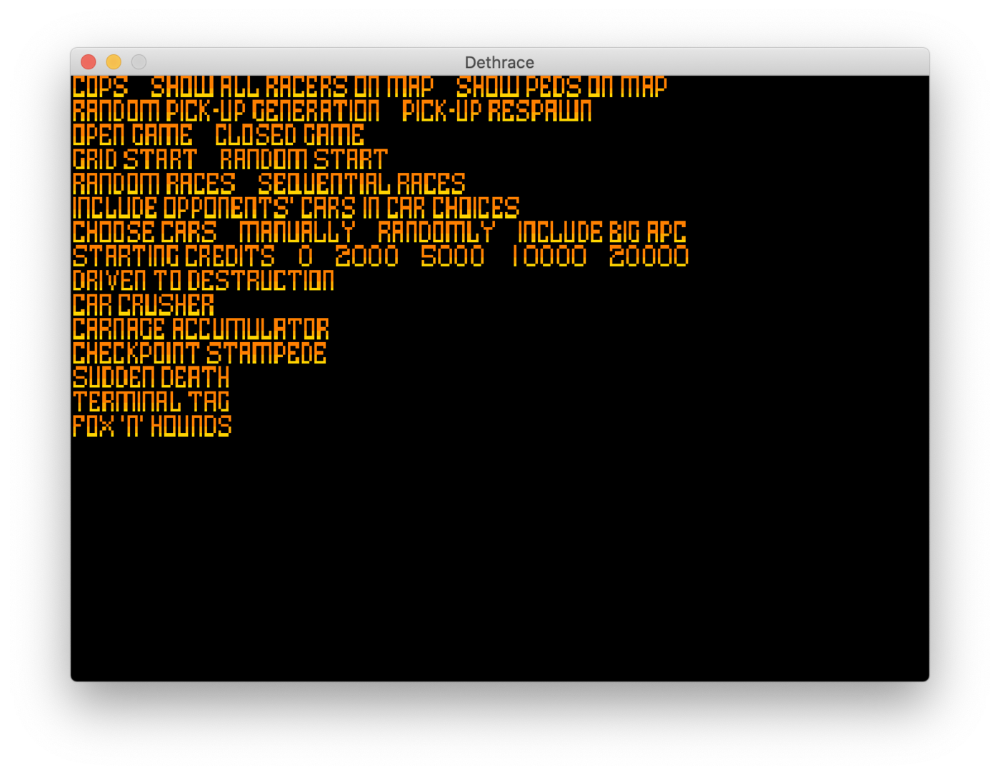
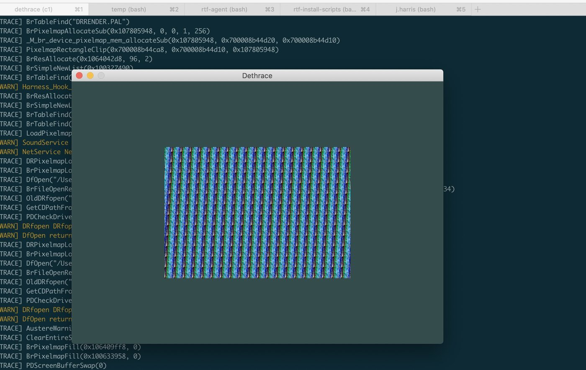
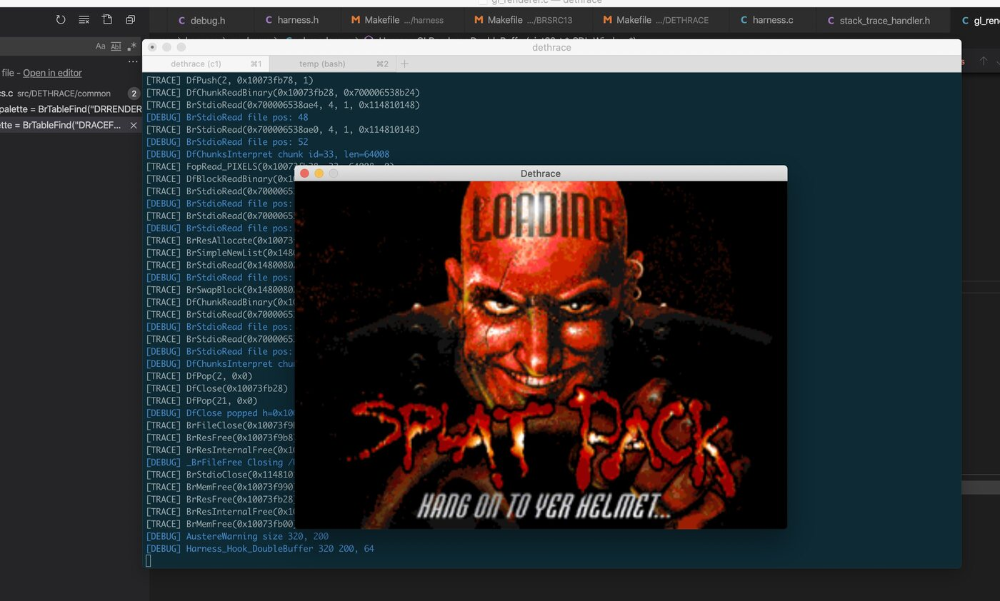
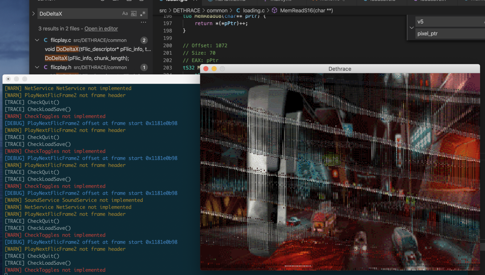
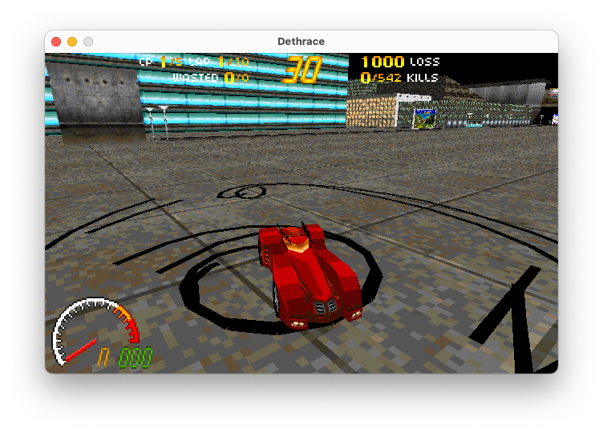
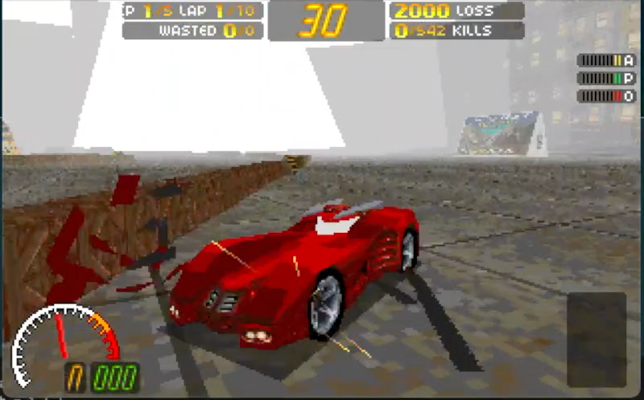

# Dethrace: rebuilding Carmageddon one function at a time

_TL;DR — I made [Dethrace](https://github.com/dethrace-labs/dethrace), a project to reverse engineer the 1997 game Carmageddon and rebuild it to run natively on modern systems. It began with a forgotten debugging-symbol file, grew through years of manual decompilation, and now uses matching assembly—and AI—to verify the reconstruction instruction by instruction._

## A file that should not have been there

Back in 2014, I found a file named `DETHRSC.SYM` on the Carmageddon Splat Pack CD. It was a Watcom debugging-symbol file, apparently left behind from an internal build at Stainless Software.

That was an extraordinary little accident. The retail game did not include its source code, but this file still contained the names of thousands of functions, global variables, data structures and original source files. It told us that functions with names like `ClearTwattageOccurrenceVariables()` and `DrawSceneyMappyInfoVieweyThing()` existed. It even preserved the original source directory: `C:\DETHRACE`.


_The symbols loaded in the Watcom debugger. We had the names, but the addresses pointed at the wrong code._

There was one large problem: the symbols came from an earlier internal build and did not match any released Carmageddon executable. The function names were real, but their addresses were useless against the game people could actually run.

I [dumped the symbols to JSON and generated rough C headers from them](/2014/12/02/carma1-symbols-dumped/). At that point it was an interesting piece of game archaeology, but not yet a route to rebuilding the game.

## Symbol dump → skeleton generator → decompile → repeat

A few years later, CrayzKirk began manually matching functions and data structures from the old symbols to the released DOS executable in IDA. That proved the mismatched symbols were still useful: the two builds were different, but recognisably related.

The next breakthrough came from Watcom's `exedump` tool. It exposed richer type information than my first dumper had found. After fixing a bug in `exedump`, I could finally recover function arguments correctly.

That gave me the first Dethrace production line:

```text
symbol dump → skeleton generator → decompile → repeat
```

The symbol dump supplied the vocabulary of the original program: source filenames, function signatures, globals, types and structs. I wrote a generator that turned that information into a giant C project with the same broad shape as the original source tree. Most functions were initially empty stubs, but now every mystery had a name and somewhere to live.

The first correct generated skeleton landed in November 2019. It did not compile. Four days later, after a lot of type fixes, duplicate symbols and platform scaffolding, it compiled on macOS and Linux.

Compiling was only the beginning. From there, the work was deliberately repetitive: choose a function, read its disassembly, reconstruct a plausible C implementation, compile it, see what broke, and repeat. Each function brought a few more behaviours back to life and exposed the next layer of missing dependencies.

## The first pixels

For a long time the milestones did not look much like a driving game. On July 6, 2020, the new OpenGL renderer produced a black window and exited. That was progress: the game had made it far enough to create a window!

I kept a collection of [progress screenshots](https://github.com/dethrace-labs/dethrace/blob/main/docs/SCREENSHOTS.md) from this period. Looking at them now is a good reminder that reverse engineering rarely moves in a straight line. A broken image could mean the file loader, palette handling and renderer were all partly correct; the corruption was evidence that we had reached a new layer of the game.



_July 2020: the first font rendering test. Getting Carmageddon's original bitmap fonts onto the screen meant the resource loading, palette and 2D drawing paths were beginning to connect._



_Also July 2020: not exactly the intended picture, but definitely pixels from the game. The enormous trace log behind the window was often more useful than the window itself._



_A recognisable Splat Pack loading screen emerged next. At this stage every successfully decoded image felt like a small miracle._



_August 2020: animation playback was close enough to reveal a frame, but not close enough to draw it cleanly. The vertical stripes came from a bug in the FLIC decoder._

<video class="video" autoplay loop muted playsinline controls>
  <source src="2020-09-menu.mp4" type="video/mp4">
</video>

_September 2020: the main menu rendered, animated and responded to the keyboard. Pressing Enter on any option was still an efficient way to crash it._

In April 2021 the real game loop ran far enough to show a mostly black screen with 2D overlays.

Then the pieces started joining together. Flat-shaded track geometry appeared in July 2021. A couple of months later the car could move around the track—provided its wheels did not leave the ground, because collision detection was still missing.



_January 2022: textures were working. It was beginning to look unmistakably like Carmageddon, even when many systems underneath it were still incomplete._



_March 2022: fog and darkness arrived via the original shade-table system. Small details like this made the reconstructed game feel much closer to the 1997 original._

Vehicle damage and pedestrians followed in 2022. Audio, Action Replay, higher-resolution rendering and network support arrived after that. In 2024, Argonaut's original BRender source was made available, so we replaced our reverse-engineered version of the rendering library with the real thing.

What began as my slightly unreasonable experiment had become a real open-source collaboration. Dethrace would not be where it is without the people who mapped symbols, reconstructed functions, fixed platform code, tested obscure game behaviour and kept attacking the enormous pile of missing pieces.

## “It seems to work” is not enough

Our original method was aimed at functional correctness. If the reconstructed C loaded the right files, moved the right objects and produced the right pixels, that was a good sign.

But reverse engineering is full of implementations that look right until one strange input takes a different branch. A hand-written decompilation can be perfectly reasonable C and still differ from the original in a tiny, important way. The game may run for hours before that difference matters.

So in 2025 we changed the definition of done. We added support for compiling Dethrace with Microsoft Visual C++ 4.20—the same era of compiler used for the Windows 95 game—and began comparing our generated code directly with the retail `CARM95.EXE` using the [reccmp](https://github.com/isledecomp/reccmp) toolchain.

Instead of asking only _“does this function behave correctly?”_, we could now ask _“does this C produce the same x86 assembly as the original function?”_

```text
reconstructed C
      ↓
Microsoft Visual C++ 4.20
      ↓
generated x86  ←→  original CARM95.EXE
                    reccmp
```

This changed the work. Variable order, signed comparisons, loop shape, early returns and the exact nesting of an `if` statement can all change the assembly a compiler emits. Two pieces of C may be logically equivalent while producing noticeably different machine code. A 100% match is unusually strong evidence that we recovered not only the behaviour, but something very close to the original source.

Not every function can match perfectly. Floating-point scheduling and compiler entropy can leave differences that are effectively equivalent. But assembly matching gave us a much more objective correctness signal than a test drive and a hopeful shrug.

## AI meets a 1997 compiler

In 2026 I started using AI coding agents to help with the assembly-matching loop.

This turned out to be a particularly good use for them. The task is constrained, repetitive and instantly testable. An agent can inspect one reconstructed function, compare our assembly with the retail assembly, make one small C change, compile it with Visual C++ 4.20, run `reccmp`, and keep the change only if the match improves.

The guardrails matter. The agent is told not to change the function signature, invent variables, wander into neighbouring functions or “clean up” odd-looking original behaviour. It maps stack slots first, changes one thing at a time, and stops when the mismatch is likely compiler entropy. Strange-looking code is sometimes exactly what an old compiler needs to recreate the original instruction sequence.

AI does not get to declare that a function is correct. The binary comparison does that. The useful part of AI here is its ability to search through many plausible C expressions and control-flow shapes without getting bored. The useful part of the toolchain is that every suggestion is judged against the actual 1997 executable.

That combination—machine-speed iteration with assembly-level verification—has helped us work through the long tail of functions where the C was already broadly correct but the generated instructions were not.

## Where it is now

Dethrace now runs natively on modern macOS, Linux and Windows systems. It uses the data files from an original copy of Carmageddon—the repository does not ship the game's assets—and supports several original demo releases as well.

There is still work to do. Assembly matching keeps uncovering small differences, and a project reconstructed function by function is never short of interesting edge cases. But the path from an abandoned `.SYM` file to a portable, playable and instruction-verifiable rebuild still feels improbable to me.

The name is not quite a typo, by the way. `DETHRACE` is what the original developers called the source directory. Nearly thirty years later, it is also the name of the project putting that source back together.

You can follow the project, build it, or help with the next function at [github.com/dethrace-labs/dethrace](https://github.com/dethrace-labs/dethrace).
