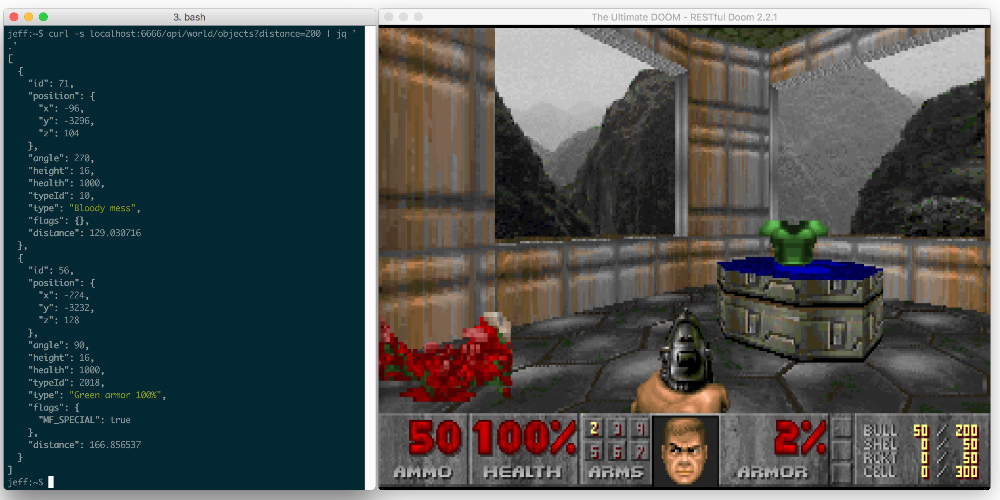
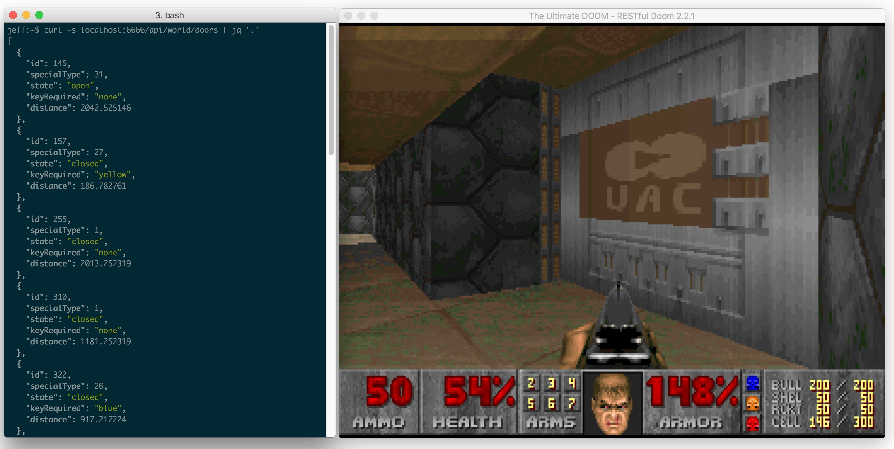

TL;DR I embedded a RESTful API into the classic 1993 game DOOM, allowing the game to be queried and controlled using HTTP and JSON.

## _"We fully expect to be the number one cause of decreased productivity in businesses around the world."_  
### &nbsp;&nbsp; _- ID Software press release (1993)._
 

## 1993
1993 was an exciting year - [Sleepless in Seattle](http://www.imdb.com/title/tt0108160/) opened in theatres, Microsoft shipped [Windows NT 3.1](https://en.wikipedia.org/wiki/Windows_NT_3.1), and Whitney Houston's 'I Will Always Love You' was [the best selling song for 2 straight months](https://en.wikipedia.org/wiki/List_of_Billboard_Hot_100_number-one_singles_of_1993). Oh, and a game called [Doom](https://en.wikipedia.org/wiki/Doom_(1993_video_game)) was released!

Doom was created by a small team at [ID Software](https://en.wikipedia.org/wiki/Id_Software). Wikipedia describes it as one of the most significant and influential titles in video game history, and growing up I loved playing it. As an adult I couldn't put down a book called [Masters of DOOM](https://en.wikipedia.org/wiki/Masters_of_Doom), which describes the back story of ID Software.

ID Software has a super cool practice of releasing source code for their games. For the kind of hackers who lurk on [/r/gamedev](https://reddit.com/r/gamedev), an ID Software engine is an amazing resource to learn from. And lo, in 1997, the Doom engine [source code](https://github.com/id-Software/DOOM) was released, causing much happiness!

## 2017
I was having trouble finding a fun API to use in a talk I had to do. I had spent the normal amount of time procrastinating and stressing about having to give the talk, and wasn't making any progress on building a compelling demo.  

Late one night, out of the blue, I had the idea to create an API for Doom, now _24 years old(!)_, and obviously never designed to have an API. I could have some fun digging around the Doom source code and solve my API problem at the same time!

My random idea became [RESTful-DOOM](https://github.com/jeff-1amstudios/restful-doom) - a version of Doom which really does host a RESTful API! The API allows you to query and manipulate various game objects with standard HTTP requests as the game runs.

There were a few challenges:
 - Build an HTTP+JSON RESTful API server in C. 
 - Run the server code inside the Doom engine, without breaking the game loop. 
 - Figure out what kinds of things we can manipulate in the game world, and how to interact with them in memory to achieve the desired effect!

I choose [chocolate-doom](https://github.com/chocolate-doom/chocolate-doom) as the base Doom code to build on top of. I like this project because it aims to stick as close to the original experience as possible, while making it easy to compile and run on modern systems.

## Hosting an HTTP API server inside Doom

chocolate-doom already uses [SDL](https://www.libsdl.org/), so I added an `-apiport <port>` command line arg and used `SDLNet_TCP_Open` to open a TCP listen socket on startup. Servicing client connections while the game is running is a  bit trickier, because the game must continue to update and render the world many times a second, without delay. We must not make any blocking network calls. 

The first change I made was to edit `D_ProcessEvents` (the Doom main loop), to add a call to our new API servicing method [`API_RunIO`](https://github.com/jeff-1amstudios/restful-doom/blob/master/src/doom/api.c#L65). This calls 
`SDLNet_TCP_Accept` which accepts a new client, or immediately returns NULL if there are no clients.  
If we have a new client, we add its socket to a SocketSet by calling `SDLNet_TCP_AddSocket`. Being part of a SocketSet allows us to use the non-blocking `SDLNet_CheckSockets` every tic to determine if there is data available.  
If we do have data, [`API_ParseRequest`](https://github.com/jeff-1amstudios/restful-doom/blob/master/src/doom/api.c#L111) attempts to parse the data as an HTTP request, using basic C string functions. I used [cJSON](https://github.com/DaveGamble/cJSON) and [yuarel](https://github.com/jacketizer/libyuarel/) libraries to parse JSON and URI strings respectively.

Routing an HTTP request involves looking at the [method and path](https://www.w3.org/Protocols/rfc2616/rfc2616-sec5.html), then calling the right implementation for the requested action. Below is a snippet from the [`API_RouteRequest`](https://github.com/jeff-1amstudios/restful-doom/blob/master/src/doom/api.c#L143) method:


if (strcmp(path, "api/player") == 0)
{
    if (strcmp(method, "PATCH") == 0) 
    {
        return API_PatchPlayer(json_body);
    }
    else if (strcmp(method, "GET") == 0)
    {
        return API_GetPlayer();
    }
    else if (strcmp(method, "DELETE") == 0) {
        return API_DeletePlayer();
    }
    return API_CreateErrorResponse(405, "Method not allowed");
}


Each action implementation (for example [`API_PatchPlayer`](https://github.com/jeff-1amstudios/restful-doom/blob/master/src/doom/api_player_controller.c#L94)) returns an `api_response_t` containing a status code and JSON response body.

Putting it all together, this is what the call graph looks like when handling a request for `PATCH /api/player`:


D_ProcessEvents();
  API_RunIO();
    SDLNet_CheckSockets();
    SDLNet_TCP_Recv();
    API_ParseRequest();
    API_RouteRequest();
      API_PatchPlayer();
    API_SendResponse();


## Interfacing with Doom entities

Building an API into a game not designed for it is actually quite easy when the game is written in straight C. There are no private fields or class hierarchies to deal with. And the [extern](https://en.wikipedia.org/wiki/External_variable) keyword makes it easy to reference global Doom variables in our API handling code, even if it feels a bit dirty ;)

cJSON library is used to generate the JSON formatted response data from API calls.

We want the API to provide access to the current map, map objects (scenery, powerups, monsters), doors, and the player. To do these things, we must understand how the Doom engine handles them. 

The current episode and map are stored as [global](https://github.com/jeff-1amstudios/restful-doom/blob/master/src/doom/g_game.c#L101) [int](https://github.com/jeff-1amstudios/restful-doom/blob/master/src/doom/g_game.c#L102) variables. By updating these values, then calling the existing `G_DeferedInitNew`, we can trigger Doom to switch smoothly to any map and episode we like.

Map objects ([mobj_t](https://github.com/jeff-1amstudios/restful-doom/blob/master/src/doom/p_mobj.h#L201-L284)) implement both scenery items and monsters. I added an `id` field which gets initialized to a unique value for each new object. This is the id used in the API for routes like `/api/world/objects/:id`.

To create a new map object, we call the existing `P_SpawnMobj` with a position and type. This returns us an `mobj_t*` that we can update with other properties from the API request.

The local player ([player_t](https://github.com/jeff-1amstudios/restful-doom/blob/master/src/doom/d_player.h#L78-L161)) is stored in the first index of a global array of players. By updating fields of the player, we can control things like health and weapon used. Behind the scenes, a player is also an `mobj_t`.

A door in Doom is a [line_t](https://github.com/jeff-1amstudios/restful-doom/blob/master/src/doom/r_defs.h#L176-L212) with a special door flag. To find all doors, we iterate through all `line_t` in the map, returning all lines which are marked as a door. To open or close the door, we call the existing `EV_VerticalDoor` to toggle the door state.

## API Specification

An API spec describes the HTTP methods, routes, and data types that the API supports. For example, it will tell you the type of data to send in a POST call to `/api/world/objects`, and the type of data you should expect in response.  
I wrote the [API spec](https://github.com/jeff-1amstudios/restful-doom/blob/master/RAML/doom.raml) in RAML 1.0. It is also hosted in a [public API Portal](https://anypoint.mulesoft.com/apiplatform/jeff-1amstudios/#/portals/organizations/e8ceea04-621e-4f69-a3c8-3f68ad7a99e2/apis/31095516/versions/1693639/pages/282163) for easier reading.

## Putting it all together

So now we have an HTTP+JSON server inside Doom, interfacing with Doom objects in memory, and have written a public API specification for it. Phew!  
We can now query and manipulate this 24 year old game from any REST API client - heres a video proving exactly that! Enjoy ;)

[restful-doom on GitHub](https://github.com/jeff-1amstudios/restful-doom/)

<iframe src="http://www.youtube.com/embed/Km6_AwzZmf0?rel=0" frameborder="0" allowfullscreen></iframe>

   

