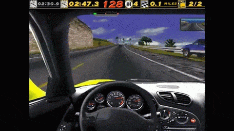
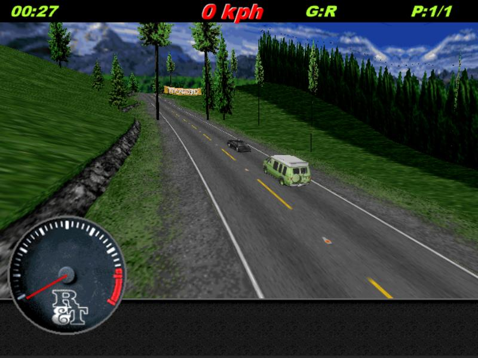

# Need for Speed 1
In the original Need for Speed 1 game, there are 9 open-road tracks in 3 environments (Alpine, Coastal, City). They are 'real' roads with traffic, as opposed to the circuit tracks where you simply raced a number of laps. The end of each open-road track is marked by a checkpoint, and once you drive underneath it, the car brakes to a stop, and the race is over.

## What adventures lie beyond the checkpoint?
The faster you drive under the checkpoint, the further past the checkpoint you travel before the race ends.
When I played this game back as a kid, I was fascinated with what lay beyond. It seems like the track keeps going. What is around the next bend, over the next hill? No-one knows except for the original developers! 

For people who haven't played the original (or did, but forgot in the last 20 years, heres a quick clip of exactly that happening.)  See the track carrying on to who knows where!

## Track scenery

In the track data files, the checkpoint is a piece of scenery, just like a tree or road sign.  Each scenery item has a position and an orientation, relative to the track, and a pointer to a scenery descriptor. 

A scenery descriptor describes a type of scenery, including size, textures, vertices, animations etc. Many scenery items can share a single descriptor. 


typedef struct SceneryObject
{
	SceneryObjectDescriptor *descriptor;
	int reference_node;
	float orientation;
	Vector3 position_relative_to_road;
}


typedef struct SceneryObjectDescriptor
{
	int id;
	float width, height;
	SceneryFlags flags;
	SceneryType type;
	int resource_id, resource2_id;
	int animation_frame_count;
}


## How are checkpoints implemented?
After some digging, it turns out that the checkpoint scenery descriptor always has `resource_id = 0x7c`. `0x7c` always points to the checkpoint texture for the track. And `0x7c` is hardcoded into the engine so that is knows that _this scenery item_ is the checkpoint, and if you drive past it, apply the brakes and end the race.

## OpenNFS1
With [OpenNFS1](http://1amstudios.com/projects/opennfs1), (my open-source NFS1 engine) we control whether the checkpoints stop your car or if allow you to drive right past them. 

What this means, is _we can now see those parts of the track which haven't been seen by anyone except the original developers back in 1995!_

In this screenshot, we've driven past the checkpoint, and are looking back at it. This is the first time a screenshot has been captured showing the track from this position :)

## What is there to see?
Past the checkpoints, some of the tracks continue on for quite a while, but there are no easter eggs unfortunately. It would have been great to find a photo of the dev team or something at the end of a track. But anyway, heres a video showing each of the previously lost sections of the open-road tracks!

<iframe src="http://www.youtube.com/embed/Xfv_UrDq-As?rel=0" frameborder="0" allowfullscreen></iframe>

<blockquote class="reddit-card" data-card-preview="0"><a href="https://www.reddit.com/r/gamedev/comments/39ms12/these_pixels_havent_been_seen_for_20_years/?ref=share&ref_source=embed">These pixels haven't been seen for 20 years</a> from <a href="http://www.reddit.com/r/gamedev">gamedev</a></blockquote>

