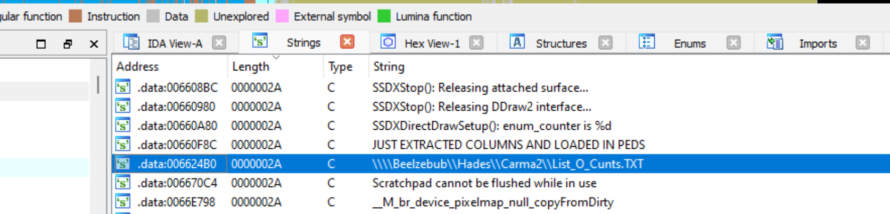
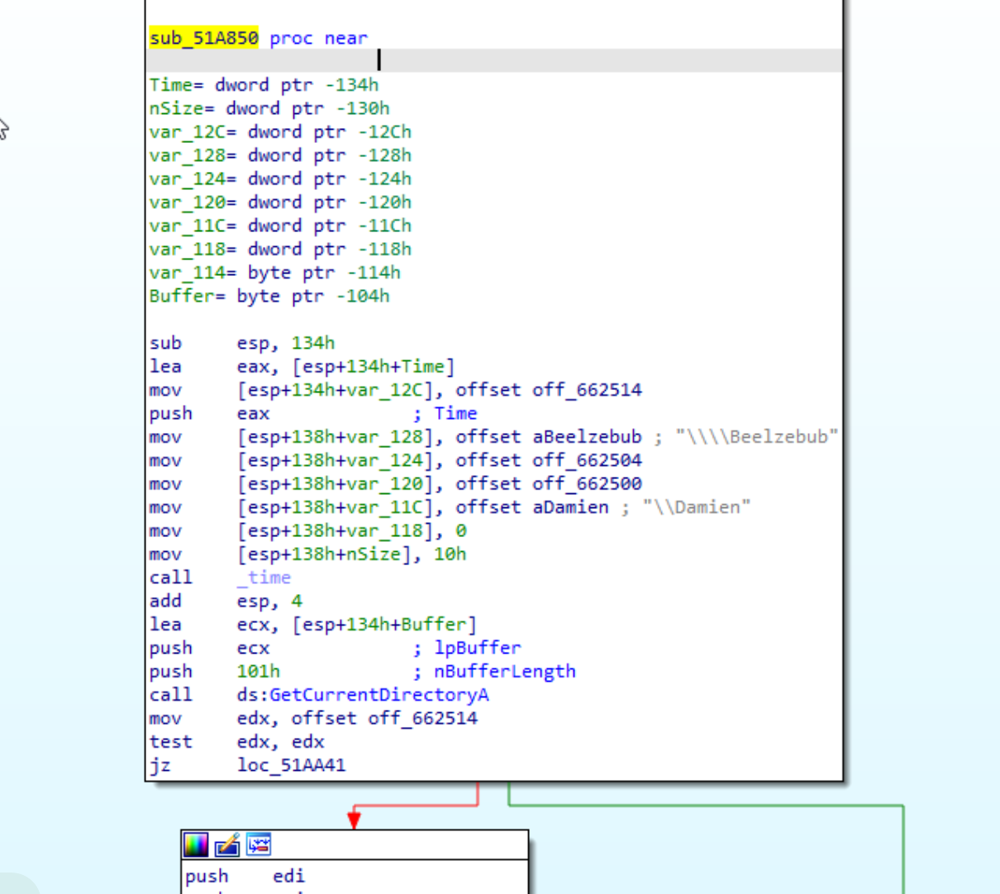
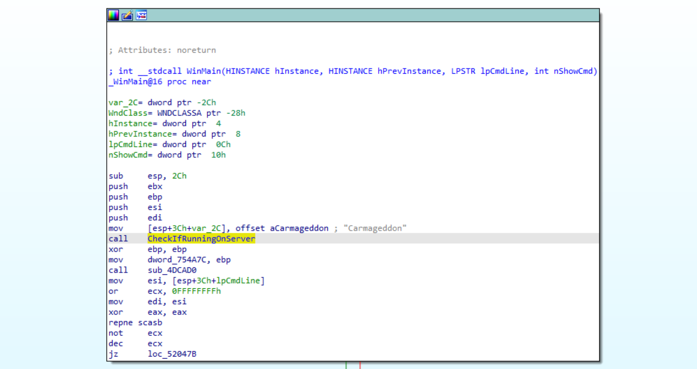
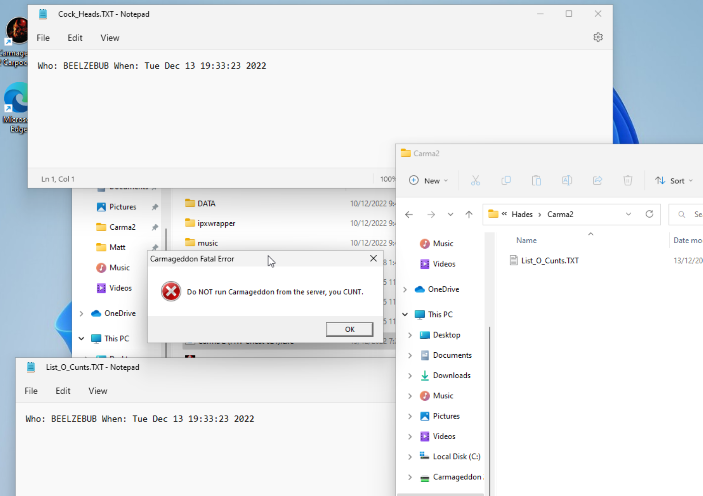

# Do NOT run Carmageddon 2 from the server

During Carmageddon 2 development, there was a problem with people running Carmageddon 2 on _"the server"_. 

The reason one should *not*, *ever*, run Carmageddon 2 from _"the server"_ is lost to history, but we know that it wasn't a small problem. Because small problems are annoying, but not worth spending precious developer effort on during development of a game. 

No, this problem was a BIG problem! _Someone_ at Stainless Software spent some time specifically writing code to check for it. Based on the...err... language used in the code, we assume it was not meant to be seen by players. 🙈

However, and happily for us, that code (while disabled) somehow made it all the way into the final retail build.

## Background
Carmageddon 2 was developed at Stainless Software on the Isle of Wight, off the coast of England, during 1997 and 1998. It was based on an enhanced version of the Carmageddon 1 engine, and supported 3d acceleration, 3d pedestrians and breakable car models.

## What does the disabled code do?

1. Compare the current directory to `H:\\`, `V:\\`, `N:\\`, `\\Beelzebub`, `\Damien`.

2. If there is a match, `GetComputerName` is called to grab the name of the computer running Carmageddon 2. 

3. `\\Beelzebub\Hades\Carma2\List_O_Cunts.TXT` is opened, and a line is appended in the form `Who: <name> When: <time>`

4. `\\Beelzebub\Hades\Users\Matt\Cock_Heads.TXT` is opened, and a line is appended in the form `Who: <name> When: <time>`

5. The message `"FATAL ERROR: Do NOT run Carmageddon from the server, you CUNT."` is shown on the screen.

6. To add insult to injury, the same message is logged to a local `Last_Error.TXT` file

7. Game exits unceremoniously

## How was this code found?
I had `carma2_hw.exe` open in IDA debugger and just idly poking around. I looked at the strings, ordered by length, and spotted `\\Beelzebub\Hades\Carma2\List_O_Cunts.TXT`, which looked... interesting! 

The only reference to it was from a block of unused code at `0x51a850`. I marked the block of unused code as a function, and IDA allowed me to decompile it.

## Bringing the code back to life
By patching the executable to call this function from `WinMain` (in a similar way to [this](/articles/reactivating-carmageddon-debug-output)), we can re-enable the code and try it out :)

To trigger the behavior, I changed my computer name to `beelzebub` and created `Hades` and `Users\Matt` shared folders. I also shared my Carma2 directory, which I mapped to a network drive (`H:\`).

With this set up, I ran `H:\carma2.exe`. For the first time since who knows when, this code executed and thought I was running Carmageddon 2 from the server! 😎

## Trivia
- The [Carmageddon 2 credits](https://www.mobygames.com/game/windows/carmageddon-2-carpocalypse-now/credits) reveals a certain Matthew was a programmer on Carmageddon 2. He is our prime suspect for implementing this server check and disgraceful error messages!

- The check of the current directory against `\Damien` will never be true. This looks like a bug caused by not escaping the `\` character. It should have been defined as `\\\\Damien` in the code instead of `\\Damien`.

## Manually tidied up version of the decompiled code


// sub_51a850
void CheckIfRunningOnServer() {   
    char* the_path;               // edx
    char* current_path;           // ebp
    char* time_string;            // eax 
    FILE* f;                      // esi 
    int computer_name_buffer_len; // [esp+0h] [ebp-138h] BYREF
    time_t the_clock;          // [esp+8h] [ebp-130h] MAPDST BYREF
    char* paths[6];               // [esp+Ch] [ebp-12Ch] BYREF
    char computer_name[16];       // [esp+24h] [ebp-114h] BYREF
    char current_directory[260];  // [esp+34h] [ebp-104h] BYREF

    paths[0] = "H:\\";
    paths[1] = "\\\\Beelzebub";
    paths[2] = "V:\\";
    paths[3] = "N:\\";
    paths[4] = "\\Damien";
    paths[5] = NULL;
    computer_name_buffer_len = 16;
    time(&the_time);
    GetCurrentDirectoryA(257, current_directory);

    the_path = paths;
    while (the_path != NULL) {
        if (strnicmp(current_directory, the_path, strlen(the_path)) == 0) {
            if (GetComputerNameA(computer_name, &computer_name_buffer_len) == 0 || computer_name_buffer_len == 0) {
                strcpy(computer_name, "UNKNOWN - lucky cunts");
            }
            f = fopen("\\\\Beelzebub\\Hades\\Carma2\\List_O_Cunts.TXT", "at");
            if (f) {
                time_string = ctime(&the_clock);
                fprintf(f, "Who: %s When: %s", computer_name, time_string);
                fflush(f);
                fclose(f);
            }
            f = fopen("\\\\Beelzebub\\Hades\\Users\\Matt\\Cock_Heads.TXT", "at");
            if (f) {
                time_string = ctime(&the_clock);
                fprintf(f, "Who: %s When: %s", computer_name, time_string);
                fflush(f);
                fclose(f);
            }
            dprintf("FATAL ERROR: %s", "Do NOT run Carmageddon from the server, you CUNT.");
            dword_6B4B24 = 1;
            sprintf(gLast_error_message, "%s\n%s", "Do NOT run Carmageddon from the server, you CUNT.");
            time(&the_clock);
            f = fopen("Last_Error.TXT", "at");
            if (f) {
                time_string = ctime(&the_time);
                fprintf(f, "When: %sError:\n%s\n---\n", time_string, gLast_error_message);
                fflush(f);
                fclose(f);
            }
            gExit_code = 700;
            if (dword_754A00) {
                v8 = *(void**)(dword_754A00 + 8);
                if (v8)
                    RunShutdownHook();
            }
            if (gBrender_initialized) {
                ShutdownBRender();
            }
            PDShutdownSystem();
        }
        the_path++;
    }
}


