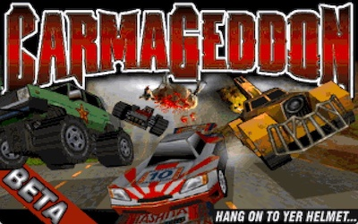
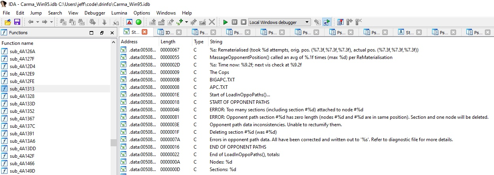
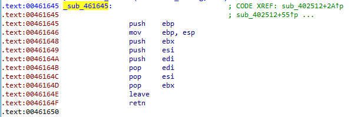
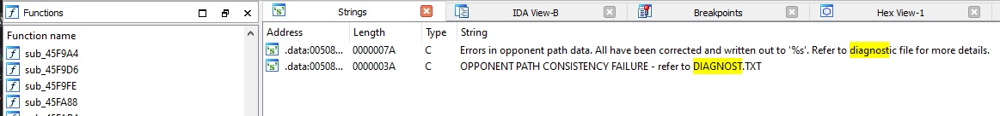
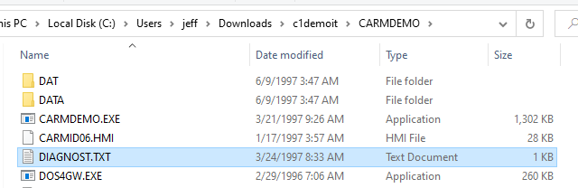
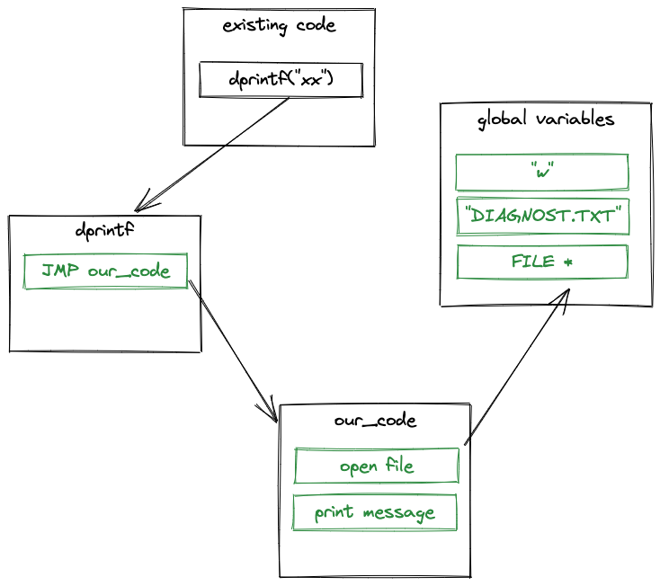
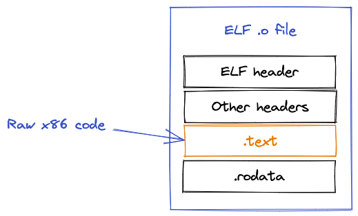
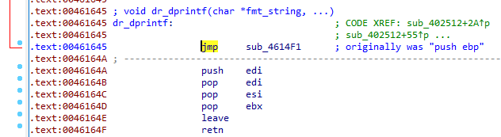

# Reactivating Carmageddon's debug output


<br>
[Carmageddon](https://en.wikipedia.org/wiki/Carmageddon) is a 1997 car game that I lost many hours of my younger life playing. The open world, do anything gameplay combined with fun vehicle physics was intoxicating. 

Looking back now, it feels like it was fun for those same basic reasons that the GTA series is fun for players today.

For some reason, it still fascinates me and I like to reverse engineer how it works.

## Debugging with printf

_“The most effective debugging tool is still careful thought, coupled with judiciously placed print statements.” — Brian Kernighan, “Unix for Beginners” (1979)_


When building software, developers need some way to test their code to make sure it is doing what it is expected. Today unit tests, CI/CD pipelines and automated integration checks are obvious, but still nothing beats `printf` for simplicity.

Stainless Software, working on this game in the mid-nineties, was certainly not practicing CI/CD. They did know all about `printf` though!

The Carmageddon executable contains many references to debug strings, easily visible in a disassembler. 



However, of course, _players_ shouldn't see this debug output - they are only expected to be read by the developers. So the retail build doesn't emit any debugging logs.

And yet...! The executable still contains those messages, so maybe we can re-enable them somehow.


## Debug output in the retail binary


For a start, its easy to trace references to these debug strings in a disassembler, and quickly you can find this function. Debug strings are always passed to it, so we guess this is the function that prints them out. 

<div style="clear:both"></div>
Unfortunately it's not very helpful - just an empty function, following the [`cdecl` calling convention](https://en.wikipedia.org/wiki/X86_calling_conventions#cdecl).


We can make a guess that the original function looked something like this. Without `DEBUGGING_ENABLED` defined, the function would be compiled with an empty body.

```c
void sub_461645(char *fmt, args...) {
#ifdef DEBUGGING_ENABLED
    ...
    printf(fmt, args);
#endif
}
```

## Archaeology

If we look hard enough, we can find traces of this debugging information. 

In the [dumped debugging symbols](http://1amstudios.com/2014/12/02/carma1-symbols-dumped/), we can see some suspicious-sounding functions[<sup>[1]</sup>](https://github.com/jeff-1amstudios/carmageddon1-symbol-dump/blob/master/symbols/DETHRACE/source/common/errors.c#L20-L22).
```
void* OpenDiagnostics();
void* CloseDiagnostics();
void* dprintf();
```

`sub_461645` is likely `dprintf`. We will refer to it as `dr_dprintf` from now on to avoid confusion with [glibc dprintf](https://linux.die.net/man/3/dprintf).

The debug strings contain references to a _"diagnostic file"_, and a _"DIAGNOST.TXT"_ 



So now we can guess that the debug messages were written into a `DIAGNOST.TXT` file. Unfortunately, we don't know anything else about the file, as the retail executable doesn't ever create it.

## Following the trail
An [obscure Carmageddon demo](https://archive.org/details/c1demoit.7z), originally included in a magazine cover CD, contained some leftover files. 

And guess what, one of those files is a `DIAGNOST.TXT`, last modified in March 1997! Thats [three months prior](https://web.archive.org/web/19970811201824/http://www.sci.co.uk/carmageddon/news.html#sweden) to the retail release.



This is the contents of the file. 

```
DIAGNOSTIC OUTPUT
Date/time: Mon Mar 24 16:32:33 1997


      0.00: PDDoWeLeadAnAustereExistance (sic): LargestBlockAvail=4530176

      0.00: PDNetObtainSystemUserName()
     11.35: Trying to open smack file 'C:\DEMO\DATA\CUTSCENE\MIX_INTR.SMK'
     12.36: Smack file opened OK
     39.85: Sorry, but Carmageddon has run out of memory (kMem_flic_data/273828)
     39.90: FATAL ERROR: Sorry, but Carmageddon has run out of memory (kMem_flic_data/273828)
```

It seems that on that morning in 1997, the game ran out of memory and exited after 40 seconds, leaving only a few lines of debug output, but its enough to see the format of the file in case we want to reproduce it faithfully.

### Trivia
- The same demo release also includes [various](https://gist.github.com/jeff-1amstudios/f197d7c5c8b60c8657f25845e7e64285) [MEMDMP.TXT](https://gist.github.com/jeff-1amstudios/7e817421bb7d512a7276e47810ba15ae) files, presumably used by the developers to debugging memory usage over time.

- `CARMDEMO.EXE` appears to have been compiled on 21 March 1997, almost a full month before the "official" Carmageddon demo was compiled (17 April 1997).


## Back to the code

So we know a little more than we did before, and crucially we know that the original debug printing code is simply not present in the executable. If we want those messages logged, we have to _add_ some code to do it.

Here's our plan:

1. Find some existing unused function that we can overwrite with our new code
2. Find some existing unused variables that we can repurpose for storing our own variables
3. Actually write the code to print the debug messages
4. Inject an [unconditional jump](https://en.wikipedia.org/wiki/JMP_(x86_instruction)) at the top of `dr_dprintf` to redirect to our new code
5. Assemble and inject our debug printing code





A few functions up from `dr_dprintf`, we find `sub_4614F1` - a function that doesn't appear to be called from anywhere. This is where we will add our own code. 

Conceptually, our new code could be pretty simple. For now, I'm not bothering to replicate exactly the format of the `DIAGNOST.TXT` example above.

```c
if (!diagnostics_file) {
    diagnostics_file = fopen("DIAGNOST.TXT", "w");
}
vsprintf(buffer, fmt, args);
fputs(diagnostics_file, buffer);
fputc(diagnostics_file, '\n');
fflush(diagnostics_file);
```

Translating that into x86 code that we can inject into an existing executable took an embarrasing amount of effort, but this is what I ended up with.

<script src="https://gist.github.com/jeff-1amstudios/53a3dafd3d79cc4541beb71133c1cf39.js"></script>

## Patching the executable

Obviously we can't inject an assembly text file into the executable, we need to assemble it into binary machine code first.

`cc -c -masm=intel -m32 dr_dprintf.s` produces `dr_printf.o` - in our case, an ELF-format object file.



We can't inject this directly either, because all we want to pull out is the raw machine code, not all the object file metadata.

`objcopy --dump-section .text=dr_dprintf.o.raw dr_dprintf.o` does just that, and finally we have some injectable raw machine code.

Now we can add the JMP command to `dr_dprintf`, and overwrite `sub_4614F1` with our raw x86 code blob via a small [python script](https://github.com/jeff-1amstudios/carmageddon-debug-output/blob/main/patch.py).



### Trivia
- Carmageddon was originally supposed to have MIDI music. During development it was scrapped in favor of CD audio - an instrumental version of Fear Factory - Demanufacture.<a href="#references"><sup>[2]</sup></a>
- MIDI files still exist in the `SOUND` directory, and MIDI-related variables still exist in the executable.
- We've repurposed two such variables, `int gRandom_MIDI_tunes[3]` and `int gRandom_Rockin_MIDI_tunes[3]`, to store our file name and open file pointer.

## Success! 🎉 

After shall we say - _"plenty"_ - of attempts, it actually works! It blows my mind a little still that code written and assembled on a Mac in 2022 can be jammed into a Windows 95 executable from 1997 and it works! 🤯

After patching my own `CARM95.EXE`, I captured this video showing Carmageddon 1 on the left and a live view of the `DIAGNOST.TXT` on the right. 

<iframe width="560" height="315" src="https://www.youtube.com/embed/rd3hTH1XgG0" title="YouTube video player" frameborder="0" allow="accelerometer; autoplay; clipboard-write; encrypted-media; gyroscope; picture-in-picture" allowfullscreen></iframe>

The most interesting debug content relates to the AI opponent vehicles. They run through a state engine where they might be racing or actively attacking the player.

### Trivia
- If the AI vehicle is not in the player's viewport, the AI "cheats" by teleporting closer to the player - `FollowCheatyPath()` for example.
- Based on the amount of diagnostics messages, and also that the debugging symbols don't match this part of the code code very well, we can guess that opponent vehicle behavior was still being debugged and fixed right up to the retail release.

<br>
So thats it! Now we can all see diagnostics messages that probably haven't been seen since 1997, and were never intended to be seen by anyone except a handful of [talented programmers and artists](https://www.mobygames.com/game/dos/carmageddon/credits#:~:text=%2C%20Jennifer%20Purcaro-,Stainless%20Software,-Game%20Design) at Stainless Software on the [Isle of Wight](https://www.stainlessgames.com/about). ❤️


## Github

The full code including instructions on how to apply the patch or modify it are in the repo: [https://github.com/jeff-1amstudios/carmageddon-debug-output](https://github.com/jeff-1amstudios/carmageddon-debug-output)


### References
<a id="references"></a>

[[1] https://github.com/jeff-1amstudios/carmageddon1-symbol-dump/blob/master/symbols/DETHRACE/source/common/errors.c#L20-L22]()

[[2] https://carmageddon.fandom.com/wiki/Music]()
